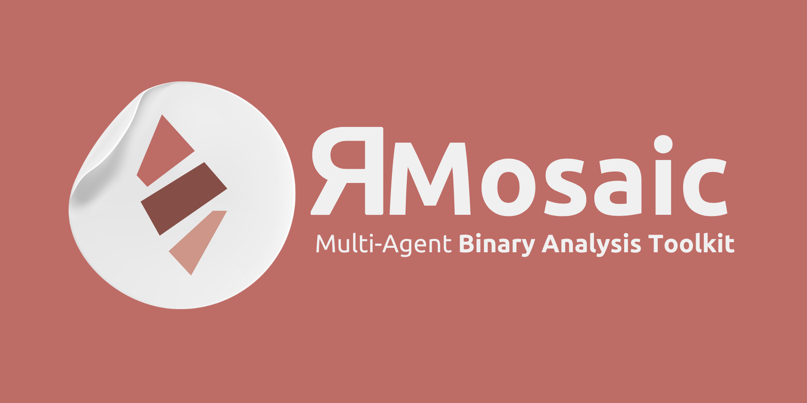

    
  </a>

 🤖 Multi-Agent Binary Analysis Toolkit 🧩 

 

# 📙 Overview
Reverse Mosaic is driven by a multi-agent large language model, and is prompted using the [ReAct](https://www.promptingguide.ai/techniques/react) prompting framework, and as such it is entirely autonomous. RMosaic includes various tools for analyzing binary files, such as extracting text, retrieving file types, finding flaws and vulnerabilities, interacting with Ghidra, and retrieving strings. Reverse Mosaic can generate query tool briefs from PDF files, providing a summary of the content and relevant information for analysis.

# 🎒 Core Tools
The following proof-of-concept tools are included in RMosaic by default.
- ⚒️ **Ghidra Tool**: The [Ghidra Tool](https://github.com/user1342/Reverse-Mosaic/tree/main/ReverseMosaic/tool_hub/tools/ghidra_tool) provides RMosaic with functionality for decompiling a binary, extracting addresses and function names, as well as checking cross-references.
- 😈 **Flawfinder Tool**: The [Flaw-Finder tool](https://github.com/user1342/Reverse-Mosaic/tree/main/ReverseMosaic/tool_hub/tools/flaw_finder_tool) allows RMosaic to identify vulnerabilities in decompiled C code.
- 🧵 **Strings Tool**: The [strings tool](https://github.com/user1342/Reverse-Mosaic/tree/main/ReverseMosaic/tool_hub/tools/strings_tool), allows RMosaic to extract strings found in a binary.

# ⭐ Supporter Tools
To support the development of Reverse Mosaic all supporters of [User1342](https://github.com/sponsors/user1342) gain access to the following tools immediatly via private GitHub repos that can be added as git-submodules. 
- 💻 **Code Analysis**: A CodeGemma LLM tool designed for explaining and writing code as tasked by the agent.

# ➡️ Get Started
Get started with [Reverse Mosaic](https://github.com/Reverse-Mosaic/Reverse-Mosaic)!
